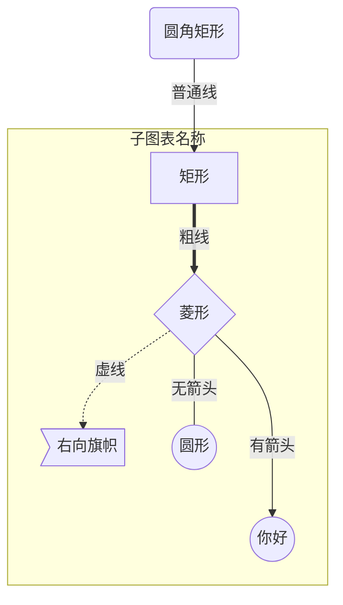
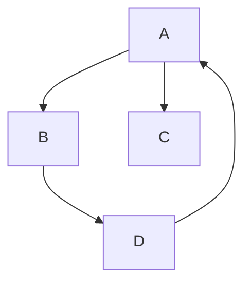
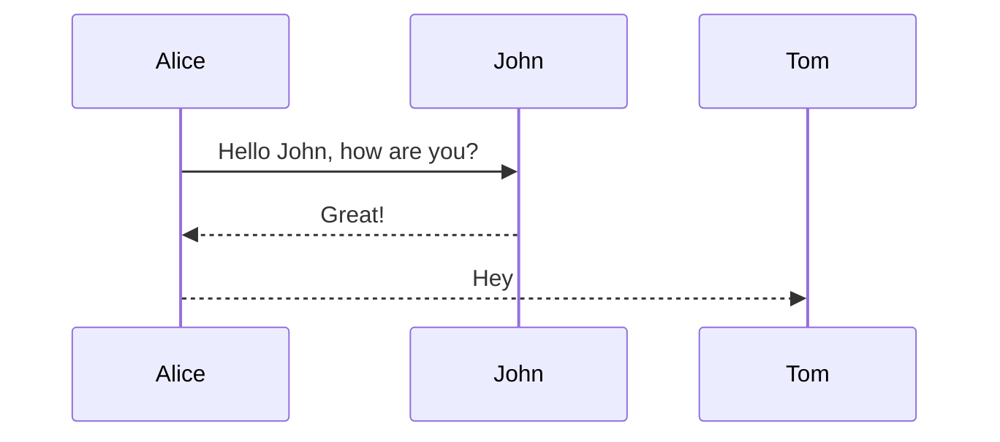
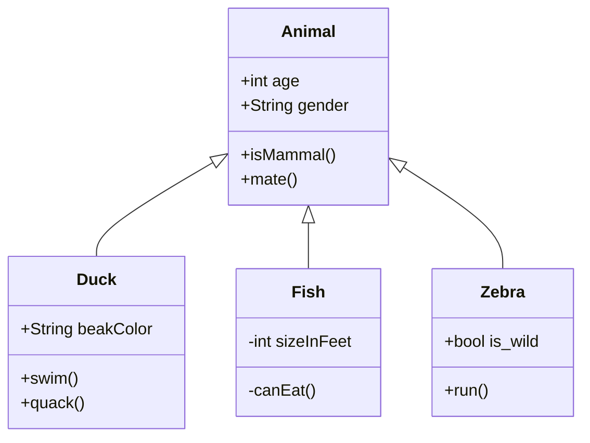
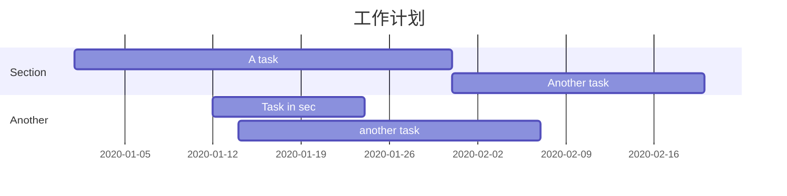
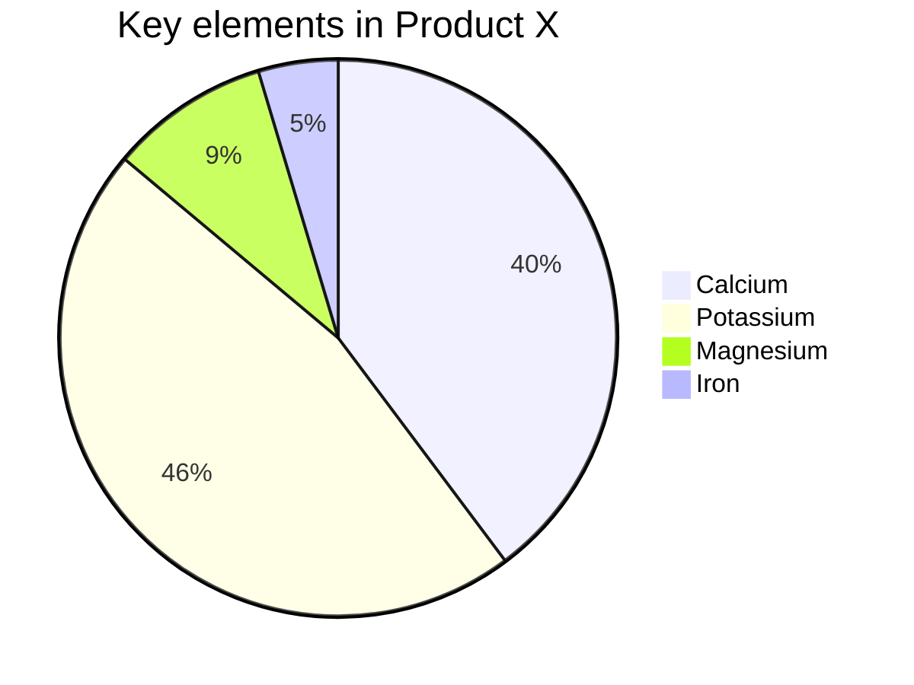

说是画图，但并不像其他专业的绘图软件那样，通过拖拖拽拽一些元素，画出流程图、[时序图](https://so.csdn.net/so/search?q=时序图&spm=1001.2101.3001.7020)等。Typora 的制图功能是由 Mermaid 强力驱动，如果你使用过 PlantUML，那么 Mermaid 也非常容易上手。

### **Mermaid**

**Mermaid[1]** 是一种简单的类似 Markdown 的脚本语言，通过 JavaScript 编程语言，将文本转换为图片。因此，真正实现画图功能的并不是 Typora 本身，它只是内置了对 Mermaid 的支持。


Mermaid 支持绘制非常多种类的图，常见的有时序图、流程图、类图、甘特图等等。下面分享一下如何绘制这些图，语法非常容易掌握。

先在 Typora 中，输入 **```mermaid** 然后敲击回车，即可初始化一张空白图。

### **流程图**

语法解释：`graph` 关键字就是声明一张流程图，`TD` 表示的是方向，这里的含义是 Top-Down 由上至下。

| Key  |     Direction      |
| :--: | :----------------: |
|  TB  | from Top to Bottom |
|  BT  | from Bottom to Top |
|  RL  | from Right to Left |
|  LR  | from Left to Right |

**节点形状**

|    节点形状     |     如何添加     |
| :-------------: | :--------------: |
|    矩形节点     |  A[Description]  |
|    圆角矩形     |  A(Description)  |
|    圆形节点     | A((Description)) |
| 右向旗帜/非对称 |  A>Description]  |
|    菱形节点     |  E{Description}  |

**节点间连线**

|          形状          |   格式   |
| :--------------------: | :------: |
|       --- 或 -->       |   单线   |
| --文本--- 或 --文本--> | 单线文字 |
|        ===或==>        |   粗线   |
| ==text=== 或==text==>  | 粗线文字 |
|       -.- 或-.->       |   虚线   |
|  -.text- 或-.text.->   | 虚线文字 |

**子图表**

```python
subgraph 子图表名称
    子图表中的描述语句...
end
```

例如：






### **时序图**

语法解释：`->>` 代表实线箭头，`-->>` 则代表虚线。



### **状态图**

语法解释：`[*]` 表示开始或者结束，如果在箭头右边则表示结束。


### **类图**

语法解释：`<|--` 表示继承，`+` 表示 `public`，`-` 表示 `private`，学过 Java 的应该都知道。




### **甘特图**

甘特图一般用来表示项目的计划排期，目前在工作中经常会用到。

语法也非常简单，从上到下依次是图片标题、日期格式、项目、项目细分的任务。




### **饼图**

饼图使用 `pie` 表示，标题下面分别是区域名称及其百分比。




### **导出**

绘制好的图片可以选择菜单/文件/导出，导出为图片或者网页格式。在网页中图片是以 SVG 格式渲染的，你可以复制 SVG 内容，导入到 SVG 的图片编辑器中进一步操作。


Mermaid 官方有一个在线的工具，可以导出 SVG 和 PNG。

Mermaid live editormermaid-js.github.io


### Flow语法绘制流程图

```flow
st=>start: 开始框
op=>operation: 处理框
cond=>condition: 判断框(是或否?)
sub1=>subroutine: 子流程
io=>inputoutput: 输入输出框
e=>end: 结束框
st->op->cond
cond(yes)->io->e
cond(no)->sub1(right)->op
```

```flow

st=>start: 开始框
op=>operation: 处理框
cond=>condition: 判断框(是或否?)
sub1=>subroutine: 子流程
io=>inputoutput: 输入输出框
e=>end: 结束框
st(right)->op(right)->cond
cond(yes)->io(bottom)->e
cond(no)->sub1(right)->op
```


